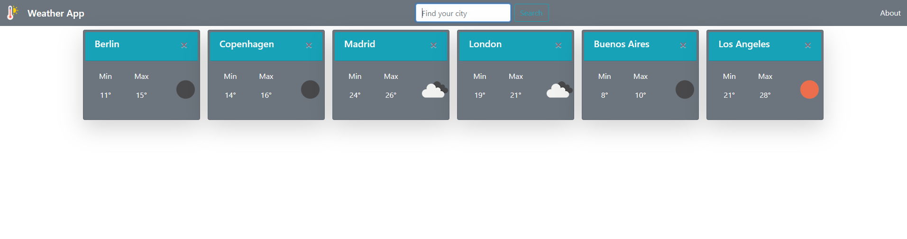
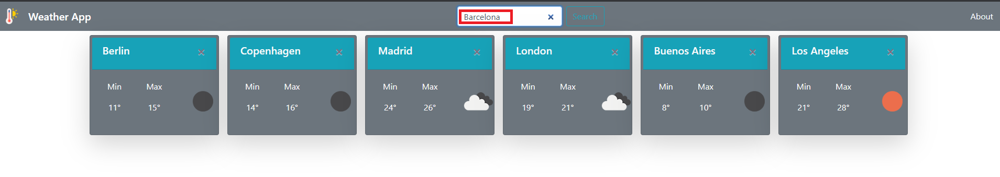
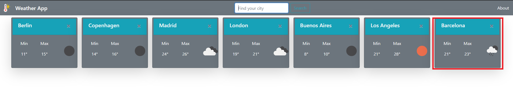
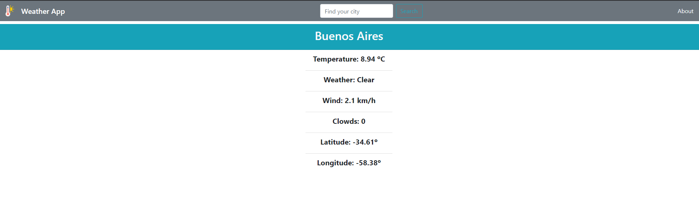

# Weather-App

Instructions for run this project

From root folder "weather-app" you should be able to run the following commands:

`npm install`: Installs all the dependencies needed for run the project.

`npm start`: Runs the app from your local host, so you can use it from your browser at http://localhost:3000

Here are some screenshots of the app running:

  

You should be able to find any city by using the search bar, since this app is connected to `openweathermap.com` API.

  

Every search you make will be adding a new card to the main screen

  

Finally, you should be able to get more detailed information by clicking on a city name.

  

